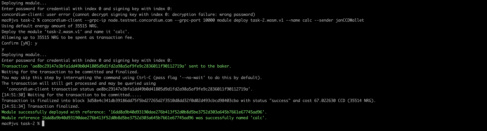
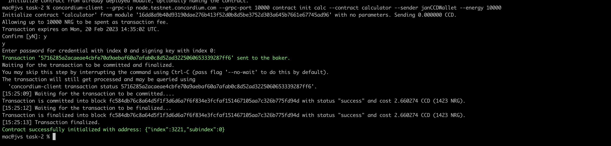
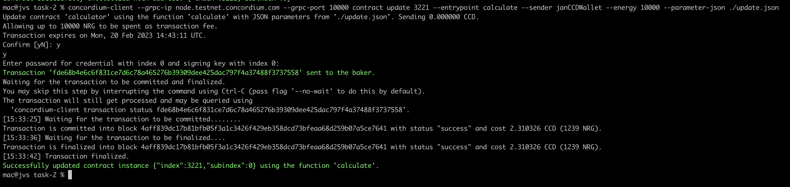
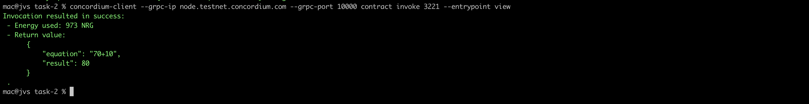

# ccd-task-2
## Mainnet Address
3AhPwJ2XwMqm89s1VKpcSWWWZnHgtUJkCMAkXKdxhZCNd6cEWr

## Deploy transaction hash
ae8bc29147e3bfa1dd49b0d41805d9d1fd2a98a5af9fe9c2836011f90112719a

## Contract
16dd8a9b40d93190dae276b413f52d0b8d5be3752d303a645b7661e67745ad96

## Initialize contract transaction hash
5716285a2acaeae4cbfe70a9aebaf60a7afab0c8d52ad3225060653339287ff6

## Update contract transaction hash
fde68b4e6c6f831ce7d6c78a465276b39309dee425dac797f4a37488f3737558

## Deploy

## Initialize

## Update

## Update.json
{
 "operand1": 70,
 "operand2": 10,
 "operation": "+"

}

## Contract Invoke

